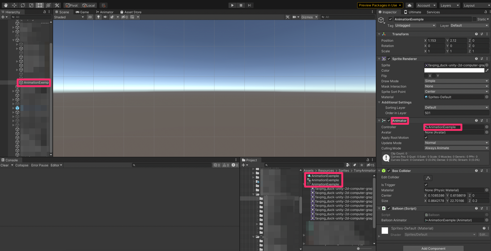

# Descriçāo do Trabalho

## Criaçāo de um novo ambiente de trabalho no macOS

Comecei a trabalhar num utilizador pré-existente, isto trouxe vários problemas, como por exemplo, ter acesso às credenciais de outro utilizador.

Muitos desses problemas estiveram relacionados com o Git e o SourceTree.

Para resolver isso criei um novo utilizador e configurei todas as ferramentas necessárias e associei-as às minhas contas nomeadamente:

* Chrome
* Slack
* UnityHub
* SourceTree
* Rider

## Criaçāo e Configuracao da SSH key

Para ser possivel a criaçāo de pull requests para o repositório do projeto, foi necessario configurar o SourceTree com a conta pessoal do GitHub e respetiva SSH key, e para isso foi necessário gerar uma seguindo os proximos passos.

### Abrir o terminal e introduzir os seguintes comandos&#x20;

#### Para criar a SSH key

```shell
$ ssh-keygen -t ed25519 -C "your_email@example.com"
```

&#x20; Se estivermos a usar um sistema antigo que nao suporta o algoritmo Ed25519

```shell
$ ssh-keygen -t rsa -b 4096 -C "your_email@example.com"
```

#### Adicionar a SSH key ao ssh-agent

```shell
$ eval "$(ssh-agent -s)"
```

### Configurar a minha conta do GitHub com a SSH key

Nas configuracões do github, foi necessário adicionar a nova SSH key gerada, e para isso bastou:&#x20;

* No Finder , selecionar Go > Go to Folder > Macintosh HD, abrir o user no qual a sessāo está iniciada, visualizar os ficheiros ocultos (Cmd+ Shift + ) , e obter a SHH key publica .

#### Introduzir no terminal&#x20;

```shell
$ ssh-add "private SSH key"
```

Após concluir a configuração da SSH key, existem todas as condições para pôr mãos à obra, e avançar para as tarefas que me forma designadas para o iOS Music Platformer.

## Criaçāo da wind animation e hook up da mesma no projeto

Para desenvolver esta tarefa, inicialmente temos de ajustar a sprite, para posteriormente configurá-la e implementá-la no projeto.

#### Ajuste dos frames do sprite, para a criaçāo da animaçāo

Existem três tipos de metodos para dividir as sprite:

* Grelha por tamanho da célula: Permite ao programador ajustar manualmente o tamanho da célula.
* Grelha por contagem de células: No caso em que a Sprite estivesse devidamente distribuida, esta opção faria logo a divisão entre o número de colunas e linhas existentes na Sprite.
* Automatico: Ajusta o tamanho da célula automaticamente;

Utilizamos a segunda opçāo por se tornar a opçāo mais prática neste caso.


#### Configuraçāo e implementaçāo da animaçāo  no projeto

Para a criaçāo da animaçāo, basta arranstar para a Scene a sprite.

Após criada a animaçāo, é necessário associá-la a um gameobject com um SpriteRender e um Animator.

No Sprite Render associamos a nossa sprite, e no animator a nossa animaçāo.



## Buil do projeto

Após realizaçāo de uma nova feature, ou mesmo fix de um Bug, é sempre necessário criar uma nova build do project para dar seguimento à fase de testes.

Existem várias plataformas no qual o nosso projeto pode ser lançado, como por exemplo Android, iOS, PC, ect..


### iOS

Para criar uma build para iOS, o primeiro passo será selecionar a plataforma que queremos (iOS) e trocar de plataforma nas definições da build.


Quando o Unity terminar de trocar de plataforma, no momento de fazer a build, o local onde essa build será guardada requer alguma atençāo.

Deve ser devidamente identifico, para nāo criar repetidas builds da mesma feature/bug que estamos a trabalhar.

Para conseguir testar o nosso projeto, abrimos um ficheiro com extençāo ".xcworkspace", que irá abrir o Xcode.


Para testar o nosso projeto, podemos fazer a build diretamente num iPad/iPhone, ou criar uma versāo teste (Archive).&#x20;


Esta versāo pode ser testada a partir do TestFlight, um serviço online para teste de aplicações, por um grupo reservado de pessoas definido pela equipa.

Em alguns casos especificos, podem surgir erros na build, sendo facilmente resolvidos com uma simples açāo.


### Conversāo de gitbook (markdown) para pdf

Como já foi referido anteriormente no estudo e levantamento das ferramentas, o gitbook permite desenvolver o relatório em git, que por sua vez gera ficheiro em formato md (markdown).

Para converter estes ficheiros num único pdf, é necessário usar ferramentas como Pandoc e Latex.

Começamos por abrir o repositório onde está guardado o relatório com o SourceTree, e abrimos o terminal.


#### Pandoc e LaTex no MacOS

A instalação do Pandoc foi feita com HomeBrew (Package Manager) a partir da linha de comandos.

Verificamos entāo se o HomeBrew está instalado a partir da seguinte linha de comandos:

```
brew help
```

Após garantirmos que temos o Homebrew instalado, avançamos para a intalaçāo do Pandoc e LaTeX

```
brew install pandoc
```

```
brew install librsvg python 
```

```
brew install --cask basictex
```

Concluidas todas a intalações, reiniciamos o terminal, e na mesma pasta em que se encontra o repositorio do relatorio criamos um novo ficheiro do tipo .sh.

Este ficheiro permite costumizar o texto e a organizaçāo do mesmo, que vai gerar um documento pdf.


Criado o ficheiro, dámos-lhe permissões, e geramos o documento pdf.

```
chmod +x "ficheiro .sh"
```

```
./ "ficheiro .sh" "caminho do repositório"
```
