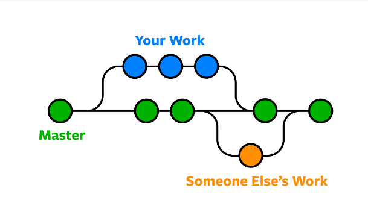

# Git

Git é um &#x20;

Git é sistema de controlo de versões, que permite que vários developers trabalharem em conjunto com maior segurança e fluxo de trabalho, porque é possível controlar todo o histórico de alterações, e caso seja necessário revertê-las.&#x20;

Para além do Git, existem outras tecnologias que podem ser classificadas em duas grandes categorias:

#### Sistemas de versionamento centralizados

* CVS e SVN possuem um repositório central, onde os developers fazem checkouts e commits.

#### Sistemas de versionamento distribuidos&#x20;

* É o caso do Git, Mercurial e Bazaar, onde não existe um repositório central.

Quer neste projeto em questāo, quer em todos os projetos em que a empresa está envolvida, é usado GIT como controlo de versões, devido aos repositórios dos projetos usarem GIT.

Outra grande razão para o uso do Git, é a enorme variedade de comandos, como também o quāo bem documentado está.   &#x20;

Para trabalhar com git e source control existem alguns conceitos que é necessário apreender, como:&#x20;

#### Repositórios&#x20;

É um diretório onde se armazena os arquivos de um projeto, que pode ser um repositório local, como por exemplo o computador, ou num repositório remoto, como o GitHub, BitBucket ou GitLab.   &#x20;

#### Branches&#x20;

Branch significa "ramo", ou seja, uma ramificação do código. Isto tem como objetivo evitar que novas funcionalidades sejam criadas sobre um determinado projeto já funcional.&#x20;

Por exemplo uma aplicação que já se encontre lancada na loja, e é necessário implementar uma nova funcionalidade, criamos um novo ramo para a desenvolver, e apos esta estar completamente funcional, efetua-se merge do branch no branch principal do projeto ('main trunk', normalmente chamado de 'master').

Isto permito que sejam desenvolvidas diversas funcionalidades simultaneamente sem interferir com o projeto original.

#### Merge

Merge é a operação que permite pegar nos ramos independentes que foram criados, e integra-los num só ramo.

#### Commits

Um commit é conjunto de alterações que foram feitas no projeto, com uma mensagem que resume essa alteração.

Uma boa pratica ao usar o git, é a criação de commits curtos, isso pode evitar perder grandes quantidades de código, como também facilita voltar atras no código caso seja necessário.

### Git LFS

Quando efetuamos clone de um repositório, é feito o dowload de todo o seu histórico.

Quando clonamos projetos que contêm grande ficheiros, como por exemplo audios, videos, etc.., é cosumida uma enorme quantidade de tempo.

Git LFS é uma extençāo Git, que reduz o impacto desses ficheiros no repositório, sendo transferidos só quando necessário.

Resumidamente, grande ficheiros são transferidos no processo de checkout e não durante a clonagem.&#x20;

